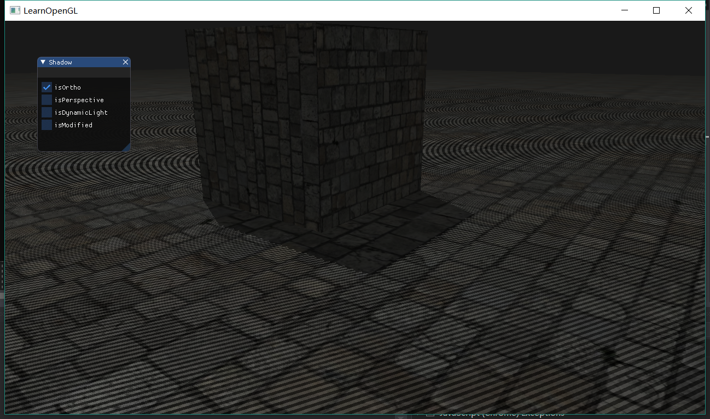
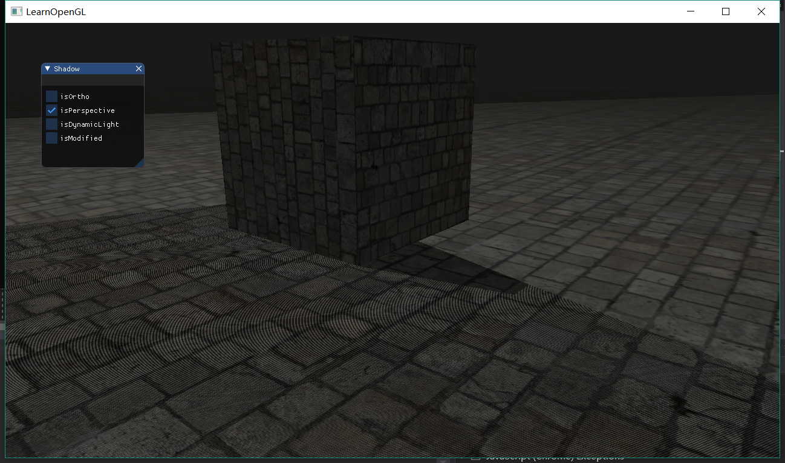
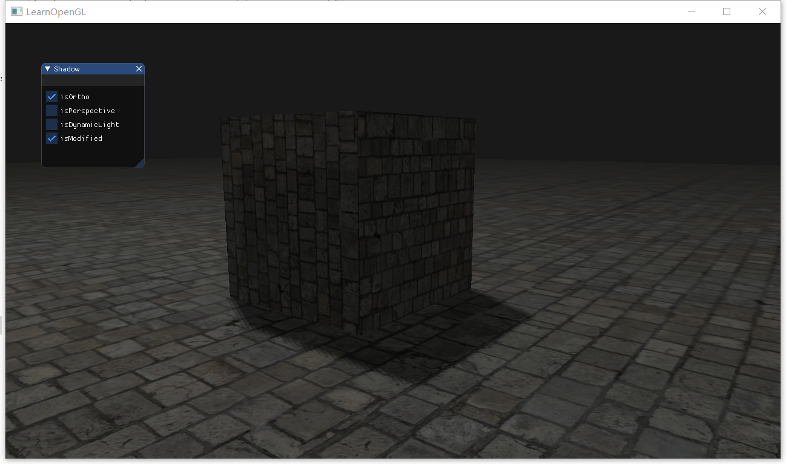
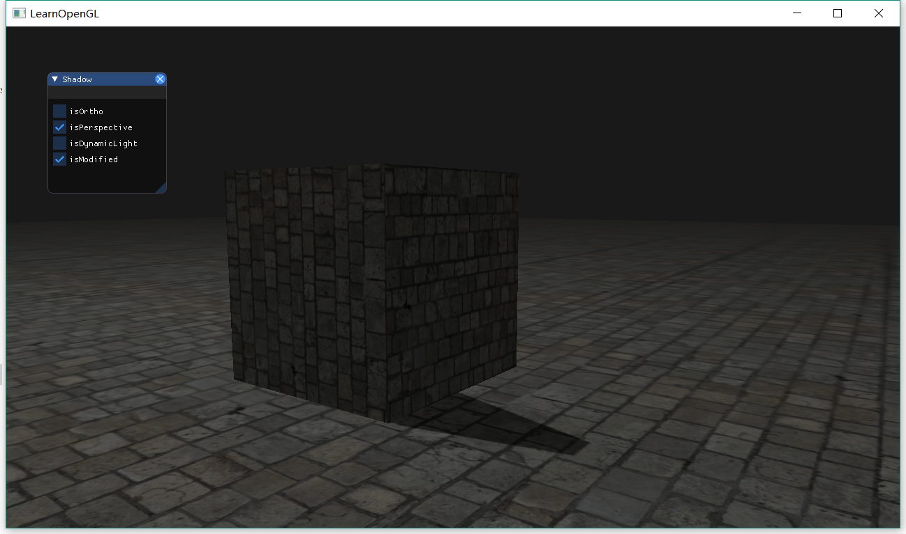

[TOC]
# Basic
## Shadow Mapping
### 深度贴图
实现效果



第一步生成一张深度贴图，深度贴图是从光的透视图里渲染的深度纹理，最近的深度是被光线照射到的地方，当深度值大于该值时，则被遮挡，显示为阴影。
```
	const unsigned int SHADOW_WIDTH = 1024, SHADOW_HEIGHT = 1024;
	unsigned int depthMapFBO;
	glGenFramebuffers(1, &depthMapFBO);
	// create depth texture
	unsigned int depthMap;
	glGenTextures(1, &depthMap);
	glBindTexture(GL_TEXTURE_2D, depthMap);
	glTexImage2D(GL_TEXTURE_2D, 0, GL_DEPTH_COMPONENT, SHADOW_WIDTH, SHADOW_HEIGHT, 0, GL_DEPTH_COMPONENT, GL_FLOAT, NULL);
	glTexParameteri(GL_TEXTURE_2D, GL_TEXTURE_MIN_FILTER, GL_NEAREST);
	glTexParameteri(GL_TEXTURE_2D, GL_TEXTURE_MAG_FILTER, GL_NEAREST);
	glTexParameteri(GL_TEXTURE_2D, GL_TEXTURE_WRAP_S, GL_CLAMP_TO_BORDER);
	glTexParameteri(GL_TEXTURE_2D, GL_TEXTURE_WRAP_T, GL_CLAMP_TO_BORDER);
	float borderColor[] = { 1.0, 1.0, 1.0, 1.0 };
	glTexParameterfv(GL_TEXTURE_2D, GL_TEXTURE_BORDER_COLOR, borderColor);
```
把生成的深度纹理作为帧缓冲的深度缓冲
```
	// attach depth texture as FBO's depth buffer
	glBindFramebuffer(GL_FRAMEBUFFER, depthMapFBO);
	glFramebufferTexture2D(GL_FRAMEBUFFER, GL_DEPTH_ATTACHMENT, GL_TEXTURE_2D, depthMap, 0);
	glDrawBuffer(GL_NONE);
	glReadBuffer(GL_NONE);
	glBindFramebuffer(GL_FRAMEBUFFER, 0);
```

生成贴图
```
		glm::mat4 lightProjection, lightView;
		glm::mat4 lightSpaceMatrix;
		float near_plane = 1.0f, far_plane = 7.5f;
		if (isPerspective) {
			lightProjection = glm::perspective(glm::radians(45.0f), (GLfloat)SHADOW_WIDTH / (GLfloat)SHADOW_HEIGHT, near_plane, far_plane);
		}
		if (isOrtho) {
			lightProjection = glm::ortho(-10.0f, 10.0f, -10.0f, 10.0f, near_plane, far_plane);
		}
		lightView = glm::lookAt(lightPos, glm::vec3(0.0f), glm::vec3(0.0, 1.0, 0.0));
		lightSpaceMatrix = lightProjection * lightView;
		// render scene from light's point of view
		simpleDepthShader.use();
		simpleDepthShader.setMat4("lightSpaceMatrix", lightSpaceMatrix);

		glViewport(0, 0, SHADOW_WIDTH, SHADOW_HEIGHT);
		glBindFramebuffer(GL_FRAMEBUFFER, depthMapFBO);
		glClear(GL_DEPTH_BUFFER_BIT);
		glActiveTexture(GL_TEXTURE0);
		glBindTexture(GL_TEXTURE_2D, woodTexture);
		renderScene(simpleDepthShader);
```

渲染至深度贴图，主要把点变换到光空间
```
#version 330 core
layout (location = 0) in vec3 position;

uniform mat4 lightSpaceMatrix;
uniform mat4 model;

void main()
{
    gl_Position = lightSpaceMatrix * model * vec4(position, 1.0f);
}
```
```
#version 330 core

void main()
{             
    // gl_FragDepth = gl_FragCoord.z;
}
```

### 渲染阴影
```
#version 330 core
layout (location = 0) in vec3 aPos;
layout (location = 1) in vec3 aNormal;
layout (location = 2) in vec2 aTexCoords;

out vec2 TexCoords;

out VS_OUT {
    vec3 FragPos;
    vec3 Normal;
    vec2 TexCoords;
    vec4 FragPosLightSpace;
} vs_out;

uniform mat4 projection;
uniform mat4 view;
uniform mat4 model;
uniform mat4 lightSpaceMatrix;

void main()
{
    vs_out.FragPos = vec3(model * vec4(aPos, 1.0));
    vs_out.Normal = transpose(inverse(mat3(model))) * aNormal;
    vs_out.TexCoords = aTexCoords;
    vs_out.FragPosLightSpace = lightSpaceMatrix * vec4(vs_out.FragPos, 1.0);
    gl_Position = projection * view * model * vec4(aPos, 1.0);
}
```
```
#version 330 core
out vec4 FragColor;

in VS_OUT {
    vec3 FragPos;
    vec3 Normal;
    vec2 TexCoords;
    vec4 FragPosLightSpace;
} fs_in;

uniform sampler2D diffuseTexture;
uniform sampler2D shadowMap;

uniform vec3 lightPos;
uniform vec3 viewPos;

float ShadowCalculation(vec4 fragPosLightSpace)
{

    vec3 projCoords = fragPosLightSpace.xyz / fragPosLightSpace.w;

    projCoords = projCoords * 0.5 + 0.5;

    float closestDepth = texture(shadowMap, projCoords.xy).r; 

    float currentDepth = projCoords.z;

    float shadow = currentDepth > closestDepth  ? 1.0 : 0.0;

    return shadow;
}

void main()
{           
    vec3 color = texture(diffuseTexture, fs_in.TexCoords).rgb;
    vec3 normal = normalize(fs_in.Normal);
    vec3 lightColor = vec3(0.3);
    // ambient
    vec3 ambient = 0.3 * color;
    // diffuse
    vec3 lightDir = normalize(lightPos - fs_in.FragPos);
    float diff = max(dot(lightDir, normal), 0.0);
    vec3 diffuse = diff * lightColor;
    // specular
    vec3 viewDir = normalize(viewPos - fs_in.FragPos);
    vec3 reflectDir = reflect(-lightDir, normal);
    float spec = 0.0;
    vec3 halfwayDir = normalize(lightDir + viewDir);  
    spec = pow(max(dot(normal, halfwayDir), 0.0), 64.0);
    vec3 specular = spec * lightColor;    
    // calculate shadow
    float shadow = ShadowCalculation(fs_in.FragPosLightSpace);                      
    vec3 lighting = (ambient + (1.0 - shadow) * (diffuse + specular)) * color;    
    
    FragColor = vec4(lighting, 1.0);
}
```
# Bouns
实现效果




主要是改变```ShadowCalculation```这个函数，解决以下几个问题
- 阴影有条纹，通过设置偏移量解决
- 光照之外的地方都是阴影，通过投影向量的z坐标大于1.0，把shadow的值强制设为0.0解决
- 阴影有锯齿，通过从纹理像素四周对深度贴图采样，然后把结果平均起来解决
```
float ShadowCalculation(vec4 fragPosLightSpace)
{
    // perform perspective divide
    vec3 projCoords = fragPosLightSpace.xyz / fragPosLightSpace.w;
    // transform to [0,1] range
    projCoords = projCoords * 0.5 + 0.5;
    // get closest depth value from light's perspective (using [0,1] range fragPosLight as coords)
    float closestDepth = texture(shadowMap, projCoords.xy).r; 
    // get depth of current fragment from light's perspective
    float currentDepth = projCoords.z;
    // calculate bias (based on depth map resolution and slope)
    vec3 normal = normalize(fs_in.Normal);
    vec3 lightDir = normalize(lightPos - fs_in.FragPos);
    float bias = max(0.05 * (1.0 - dot(normal, lightDir)), 0.005);
    // check whether current frag pos is in shadow
    // float shadow = currentDepth - bias > closestDepth  ? 1.0 : 0.0;
    // PCF
    float shadow = 0.0;
    vec2 texelSize = 1.0 / textureSize(shadowMap, 0);
    for(int x = -1; x <= 1; ++x)
    {
        for(int y = -1; y <= 1; ++y)
        {
            float pcfDepth = texture(shadowMap, projCoords.xy + vec2(x, y) * texelSize).r; 
            shadow += currentDepth - bias > pcfDepth  ? 1.0 : 0.0;        
        }    
    }
    shadow /= 9.0;
    
    // keep the shadow at 0.0 when outside the far_plane region of the light's frustum.
    if(projCoords.z > 1.0)
        shadow = 0.0;
        
    return shadow;
}
```