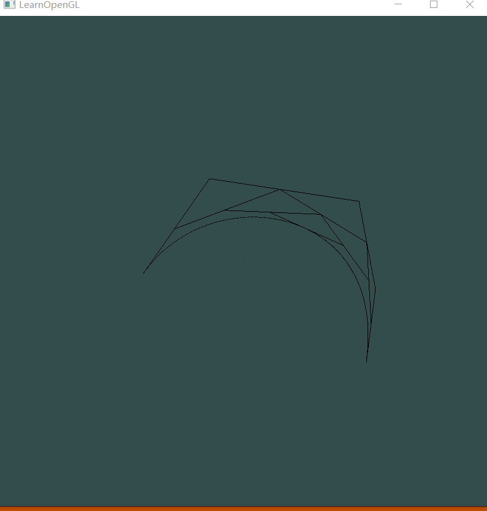

[TOC]
# Basic
## Bezier Curve
### 实现效果



### 实现算法
#### 画线
自己定义了point类
```
class point
{
public:
	GLfloat x;
	GLfloat y;
	point() {
		x = 0;
		y = 0;
	}
	point(GLfloat inputX,GLfloat inputY) {
		x = inputX;
		y = inputY;
	}
};
```
画线是给定两个点，就会画出一条线
```
void drawLine(point begin,point end) {
	float vertices[] = {
		begin.x,begin.y,0.0f, 0.0f,0.0f,0.0f,
		end.x, end.y, 0.0f, 0.0f, 0.0f, 0.0f
	};
	unsigned int VAO;
	unsigned int VBO;
	glGenVertexArrays(1, &VAO);
	glGenBuffers(1, &VBO);
	glBindVertexArray(VAO);

	glBindBuffer(GL_ARRAY_BUFFER, VBO);
	glBufferData(GL_ARRAY_BUFFER, sizeof(vertices), vertices, GL_STATIC_DRAW);

	glVertexAttribPointer(0, 3, GL_FLOAT, GL_FALSE, 6 * sizeof(float), (void*)0);
	glEnableVertexAttribArray(0);

	glVertexAttribPointer(1, 3, GL_FLOAT, GL_FALSE, 6 * sizeof(float), (void*)(3 * sizeof(float)));
	glEnableVertexAttribArray(1);

	glUseProgram(shaderProgram);
	glBindVertexArray(VAO);
	glDrawArrays(GL_LINES, 0, 2);
	glDeleteVertexArrays(1, &VAO);
	glDeleteBuffers(1, &VBO);
}
```
#### 鼠标处理
左击会生成新的点，并生成贝塞尔曲线，右击会去掉最后一个点，也会重新生成贝塞尔曲线，中击会动态显示生成曲线。
```
void MouseButtonCallback(GLFWwindow* window, int button, int action, int mods)
{
	if (button == GLFW_MOUSE_BUTTON_LEFT && action == GLFW_PRESS)
	{
		auto tempX = float(mouse_x - (SCR_WIDTH / 2)) / (SCR_WIDTH / 2);
		auto tempY = float((SCR_HEIGHT / 2) - mouse_y) / (SCR_HEIGHT / 2);
		point tempPoint(tempX, tempY);
		inputPoint.push_back(tempPoint);
		getBezier(inputPoint.size(), 500);

#ifdef DEBUG
	std::cout << "clicked : " << tempX << " " << tempY << " " << std::endl;
#endif
	}
	else if (button == GLFW_MOUSE_BUTTON_RIGHT && action == GLFW_PRESS) {
		inputPoint.pop_back();
		getBezier(inputPoint.size(), 500);
	}
	else if (button == GLFW_MOUSE_BUTTON_MIDDLE && action == GLFW_PRESS) {
		isDynamic = true;
	}
}

```


#### 贝塞尔曲线生成
用inputPoint表示输入的点，用outputPoint表示生成贝塞尔曲线的点，取样是500个
```
float B(int i, int n, float T) {
#ifdef DEBUG
	std::cout << "fac(n) = " << fac(n) << std::endl;
	std::cout << "fac(i) = " << fac(i) << std::endl;
	std::cout << "fac(n-i) = " << fac(n-i) << std::endl;
	std::cout << "pow(T,i) = " << pow(T, i) << std::endl;
	std::cout << "pow(1-T, n-i) = " << pow(1-T, n-i) << std::endl;
#endif

	return fac(n)*1.0f / (fac(i)*fac(n - i)) * pow(T, i)*pow(1 - T, n - i);
}

void getBezier(int inputPointSize,int numOfPointToDraw) {
	float deltaT = 1.0 / numOfPointToDraw;
	float T;
	for (int i = 0; i < numOfPointToDraw; i++) {
		float tempX = 0;
		float tempY = 0;
		T = i * deltaT;
		for (int j = 0; j < inputPointSize; j++) {
#ifdef DEBUG
			std::cout << "B = " << B(j, inputPointSize, T) << std::endl;
#endif 
			tempX += B(j, inputPointSize - 1, T) * inputPoint[j].x;
			tempY += B(j, inputPointSize - 1, T) * inputPoint[j].y;
		}
#ifdef DEBUG
		std::cout <<"tempX = " << tempX << " " << "tempY = " <<tempY << std::endl;
#endif 

		outputPoint[i] = point(tempX, tempY);
	}
#ifdef DEBUG
		std::cout << "getBezier" << std::endl;
		std::cout << "outputPoint.size()" << outputPoint.size() << std::endl;
#endif
}

```
# Bouns
实现动态效果
通过getPoint可以得到某个时刻两个点中间的某一点，总时间设置为4s，这里得到中间某个点用了斜率的一般方法，没有用第二章的画线算法。然后drawDyamicLine是个递归函数，每次递归生成该次的每个中间点，再将中间点传给自己实现递归，时间都是用deltaT控制。
```
point getPoint(point A, point B, float t) {
	float k = (B.y - A.y)*1.0f / (B.x - A.x);
	float deltaX = (B.x - A.x)*1.0f / 500;
	float currentX = A.x + t / 4 * deltaX * 500;
	float curretnY = A.y + t / 4 * deltaX * 500 * k;
	return point(currentX, curretnY);
}

void drawDynamicLine(std::vector<point> tempPoint, float deltaT) {

	if (tempPoint.size() < 3) {
		return;
	}
	std::vector<point> ttempPoint;
	for (int i = 0; i < tempPoint.size() - 2; i++) {
		drawLine(getPoint(tempPoint[i], tempPoint[i + 1], deltaT), getPoint(tempPoint[i + 1], tempPoint[i + 2], deltaT));
		if (i == 0) {
			ttempPoint.push_back(getPoint(tempPoint[i], tempPoint[i + 1], deltaT));
		}
		ttempPoint.push_back(getPoint(tempPoint[i + 1], tempPoint[i + 2], deltaT));
	}
	drawDynamicLine(ttempPoint, deltaT);
}
```
在主函数里面deltaT是通过currentTime - int(currentTime / 4) * 4获得的,所以在点击中键的时候大部分不是从头开始演示。
```
		if (isDynamic) {
			float currentTime = (float)glfwGetTime();
			float deltaT = currentTime - int(currentTime / 4) * 4;
			std::vector<point> tempPoint = inputPoint;
			drawDynamicLine(tempPoint,deltaT);
		}
```